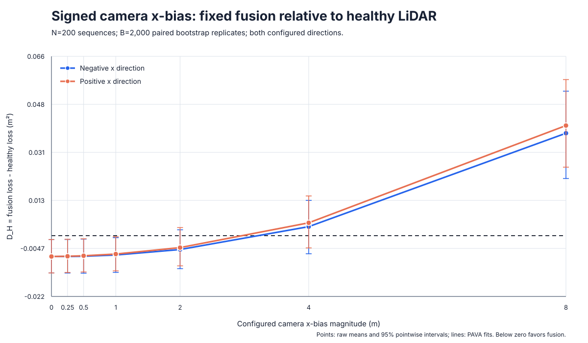
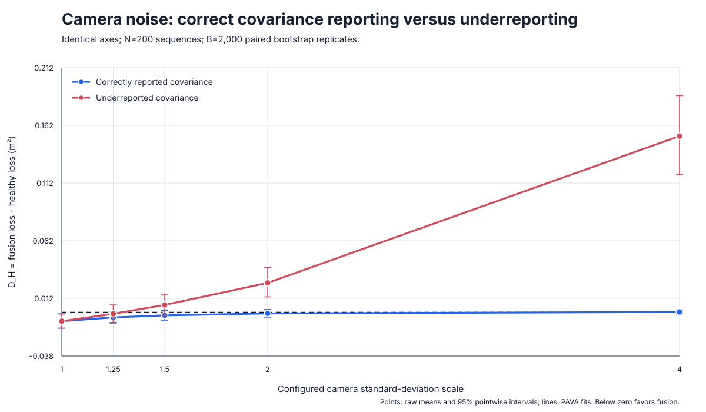
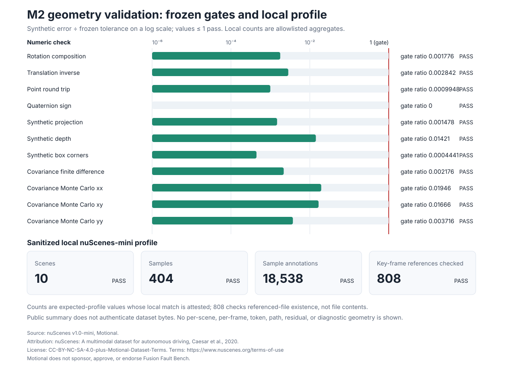
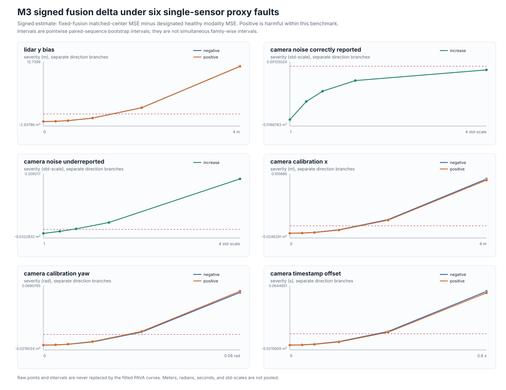

# Fusion Fault Bench

[](https://github.com/6ickomod3/fusion-fault-bench/actions/workflows/ci.yml)

**When does camera-LiDAR fusion become worse than trusting the modality
declared healthy in a controlled single-sensor fault?**

Fusion Fault Bench is a deterministic estimator-output benchmark for answering
that question under controlled calibration, timing, uncertainty, bias, and
dropout faults. It uses paired counterfactual sequences, explicit covariance,
sequence-level inference, and predeclared crossover rules.

The benchmark runs on CPU. That is a reproducibility property, not the research
contribution.

## What it evaluates

```text
Latent matched-object states
          |
          v
Camera and LiDAR estimator outputs
  - actual error model
  - reported covariance
  - true/reported pose and time
          |
          v
Manifest-defined proxy fault
          |
          v
Camera-only | LiDAR-only | fixed fusion | health gate | oracles
          |
          v
Matched-center loss | signed healthy-modality delta | crossover
```

The v0.1 contract restricts evaluation to known object IDs and BEV centers in a
common front-camera/LiDAR region of interest. This is designed to isolate fusion
behavior from detection and data association. A later version may add set
prediction and Hungarian association after the matched-center benchmark is
validated.

## Why the contract is narrow

Fusion can appear robust or harmful simply because an evaluator chose a
convenient covariance, field of view, loss aggregation, or fault insertion
point. This project fixes those choices before running the benchmark:

- physical observations use the true pose and timestamp;
- calibration and timing faults modify estimator-consumed metadata;
- actual error and reported uncertainty remain separate;
- clean and faulted conditions reuse latent scenes and random draws;
- losses are aggregated by complete sequence;
- inference uses a signed delta from the designated healthy modality;
- crossover fitting and uncertainty rules are predeclared.

See the frozen
[v0.1 benchmark contract](docs/benchmark-contract-v0.1.md).

## Quickstart

```bash
uv sync --locked --group dev
uv run ffb --version
uv run ffb manifest validate \
  examples/manifests/analytic-bias-v1alpha1.json
uv run pytest
```

The M1 analytic path can also produce and strictly reload a complete scientific
artifact from a clean checkout:

```bash
uv run ffb run \
  examples/manifests/analytic-bias-v1alpha1.json \
  --output-dir reports/generated/analytic-camera-x-bias-a603d090f77a
uv run ffb bundle validate \
  reports/generated/analytic-camera-x-bias-a603d090f77a

uv run python tools/m1_release.py validate \
  reports/releases/m1-analytic-v0.1.0
uv run python tools/m2_release.py validate \
  reports/releases/m2-geometry-v0.1.0
uv run python tools/m3_release.py validate-release \
  reports/releases/m3-procedural-v0.1.0 \
  --official-identity examples/release-identities/m3-procedural-v0.1.0.json
```

The current tools require no GPU or model checkpoint. M1 and public release
validation require no dataset. The M2 local geometry command uses a
user-provided nuScenes-mini tree through `NUSCENES_ROOT`; the package never
downloads or redistributes it.

## Evidence status

**Released: M1 analytic estimator-output evidence on a named Apple M3 Pro CPU.**

Across 200 paired sequences and 2,000 sequence-bootstrap replicates, fixed
fusion crossed the healthy-LiDAR loss under signed camera \(x\)-bias and under
camera-noise covariance underreporting. The correctly reported-noise control
did not support a finite-sample crossover claim: its point curve crossed, but
only 63.25% of bootstrap curves did, so the predeclared status is
**undetermined**.

| Controlled stress axis | Point-curve root (95% bootstrap interval) | Status | Population reference |
|---|---:|---|---:|
| Camera \(x\)-bias, negative | 3.213 m [1.310, 4.971] | Observed | 3.828 m grid / 3.869 m continuous |
| Camera \(x\)-bias, positive | 2.964 m [1.129, 4.580] | Observed | 3.828 m grid / 3.869 m continuous |
| Camera noise, correctly reported | 3.540 std-scale, interval undefined | Undetermined | No grid crossing through 4; no finite continuous root |
| Camera noise, underreported | 1.292 std-scale [1.045, 1.583] | Observed | 1.463 grid / 1.466 continuous |

Meters and standard-deviation scale are separate axes and are never combined.
These are Gaussian estimator-output stress tests, not physical sensor
tolerances or safety thresholds. See the
[complete M1 release](reports/releases/m1-analytic-v0.1.0/README.md) and its
[claim-evidence map](reports/releases/m1-analytic-v0.1.0/claim-evidence.md).





**Released: M2 geometry implementation validation and local nuScenes-mini
grounding on the same named CPU.**

The frame-aware SE(3), quaternion, projection, box, ROI, and bearing/depth
covariance implementations passed their frozen synthetic gates. One
user-provided tree matching the declared nuScenes v1.0-mini profile passed the
sanitized structural, 808 key-frame-reference existence, scalar projection,
and diagnostic-generation attestations. The record does not authenticate
dataset bytes, expose the diagnostic, or report a fault-performance result.

See the
[complete M2 release](reports/releases/m2-geometry-v0.1.0/README.md) and its
[claim-evidence map](reports/releases/m2-geometry-v0.1.0/claim-evidence.md).



**Released: M3 temporal procedural fault matrix and deterministic repeat on
the same named CPU.**

The frozen matrix contains bias, correctly and incorrectly reported noise,
camera extrinsic translation/yaw, timestamp offset, dropout, and common-mode
controls. Across the six single-sensor crossover families, nine
direction-specific roots were observed. Correctly reported camera noise was
the required counterexample: fusion remained below healthy-LiDAR loss through
the tested `4×` scale, while underreported covariance crossed at
`1.4475×` \([1.4258,1.4690]\).

At full camera dropout, camera-only and fixed-fusion conditional loss are
undefined rather than zero-imputed. Under a shared `±4 m` common-mode bias,
fixed-fusion loss rose above `16 m²` while camera-LiDAR disagreement remained
invariant to `7.11e-15 m`, exposing an agreement-only health blind spot.

The release publishes all 429 aggregate rows and all 10 crossover rows,
commits the omitted 71,700 sequence rows by hash/length/count, and records 48
of 48 byte-identical indexed-member comparisons across two full runs. See the
[complete M3 release](reports/releases/m3-procedural-v0.1.0/README.md),
[claim-evidence ledger](reports/releases/m3-procedural-v0.1.0/claim-evidence.md),
and [independent results review](docs/reviews/m3-results-review.md).



| Component | Status |
|---|---|
| Versioned manifest and result contracts | Validated |
| Canonical manifest fingerprinting | Validated |
| Analytic fusion/fault vertical slice | Released as M1 |
| SE(3) and local nuScenes-mini grounding | Released as M2 validation evidence |
| Temporal procedural benchmark | Released as M3 |
| Health-aware fallback | M4 pre-registered; implementation next |
| Released fault-performance results | M1 analytic and M3 procedural estimator-output stress tests |

Results enter this README only after they trace to a released manifest,
software revision, aggregate record, figure, named CPU run, and reproduction
command. Uncertainty intervals are required for inferential results; M2
contains deterministic validation gates and attestations, not an estimand.

## Documentation

- [Benchmark card](docs/benchmark-card.md)
- [Benchmark contract v0.1](docs/benchmark-contract-v0.1.md)
- [Evaluation protocol](docs/evaluation-protocol.md)
- [Reproducibility](docs/reproducibility.md)
- [Dataset preparation](docs/dataset-preparation.md)
- [Limitations](docs/limitations.md)
- [Results](docs/results.md)
- [Project plan](docs/project-plan.md)
- [M1 analytic pre-registration](docs/m1-analytic-plan.md)
- [M2 geometry pre-registration](docs/m2-geometry-plan.md)
- [M2 geometry release](reports/releases/m2-geometry-v0.1.0/README.md)
- [M3 temporal procedural pre-registration](docs/m3-temporal-plan.md)
- [M3 temporal procedural release](reports/releases/m3-procedural-v0.1.0/README.md)
- [M4 observable health-aware fallback pre-registration](docs/m4-health-plan.md)
- [M4 adversarial plan review](docs/reviews/m4-plan-review.md)

## Explicit non-goals

- Raw camera or point-cloud simulation.
- Training or reproducing a neural BEV detector.
- Estimating naturally occurring or fleet-level fault rates.
- Planning, collisions, or closed-loop policy evaluation.
- Production-safety, certification, or real-world robustness claims.

The Apache-2.0 license covers project code only. nuScenes and other external
assets remain governed by their own terms; see
[Data and model terms](DATA_AND_MODEL_TERMS.md).
