# M4 Technical Walkthrough: Observable Health-Aware Fallback

This document explains the M4 design, implementation, results, and failure
modes at interview depth. The frozen specification is
[`m4-health-plan.md`](m4-health-plan.md); the released evidence is
[`m4-health-v0.1.0`](../reports/releases/m4-health-v0.1.0.md).

## Thirty-second explanation

M3 measured when fixed camera-LiDAR fusion became harmful under controlled
faults. M4 asks the complementary online question: can a causal monitor,
using only pre-update residual consistency plus direct timestamp and
availability telemetry, decide when to stop fusing?

I built a CPU-only train/validation/test benchmark around that question. It
fits clean empirical residual distributions, selects one threshold pair on
validation data, freezes the fit, and evaluates transient faults, held-out
severities, a held-out yaw family, dropout, cold start, difficult-clean motion,
and common-mode controls. The main finding is deliberately nuanced: fallback
reduced loss for severe bias, timestamp, and some underreported-noise events,
but correct detection did not guarantee a good action. In particular, the
policy attributed `3×` underreported LiDAR noise on 100% of sequences yet
worsened matched-center MSE by `0.579 m²` relative to fixed fusion.

## Why M4 complements M3

| M3 | M4 |
|---|---|
| Persistent fault sweeps | Transient events with clean prefix and recovery |
| “When is fixed fusion harmful?” | “Can observable evidence route around harm?” |
| Healthy-modality contrast and crossover | Policy gain, coverage, attribution, latency, oracle gap |
| Diagnostic target-drop policy knows the fault | Deployable-feature policies cannot see fault metadata |
| Complete-sequence oracle | Frame-action oracle at the policy decision granularity |

M4 does not repeat M3's crossover analysis. It tests the decision layer that
would consume health evidence after M3 has shown that unconditional fusion can
be harmful.

## End-to-end dataflow

```mermaid
flowchart LR
    A["True latent BEV object states"] --> B["Paired camera and LiDAR estimator outputs"]
    B --> C["Transient proxy fault<br/>output, covariance, metadata, or availability"]
    C --> D["Independent two-observation histories<br/>strictly before frame k"]
    D --> E["Self and directional cross NIS"]
    E --> F["Eight clean ECDF channels"]
    C --> G["Direct availability and timestamp evidence"]
    F --> H["Raw observable label"]
    G --> H
    H --> I["Two-frame activation / three-frame recovery latch"]
    I --> J["Camera, LiDAR, fixed-fusion, or undefined action"]
    J --> K["Sequence loss, coverage, attribution, latency, oracle gap"]
    K --> L["Paired complete-sequence bootstrap"]
```



The benchmark operates on known-object estimator outputs. It does not run a
detector, render images, simulate point clouds, or solve association.

## The causal feature boundary

The monitor receives only:

- opaque object ID for history lookup;
- current camera/LiDAR BEV estimate and reported covariance;
- current modality availability;
- reference timestamp; and
- reported sensor timestamp.

It cannot receive ground truth, fault family, target, severity, direction,
event phase, seed, split, sequence ID, manifest metadata, or absolute frame
index as a feature.

This boundary matters because a benchmark can accidentally build an oracle by
passing fault labels or future information into a supposedly deployable
health decision.

### Pre-update prediction

For each object and modality, keep the two most recent available observations
strictly before frame \(k\), at \(t_a<t_b<t_k\). With

\[
h=\frac{t_k-t_b}{t_b-t_a},
\]

the constant-velocity prediction and propagated reported covariance are

\[
\hat z_k=(1+h)z_b-hz_a,\qquad
P_k^-=(1+h)^2R_b+h^2R_a.
\]

The self normalized innovation squared is

\[
\operatorname{NIS}_{m,k}
=(z_{m,k}-\hat z_{m,k})^\top(P_{m,k}^-+R_{m,k})^{-1}
(z_{m,k}-\hat z_{m,k}).
\]

Directional cross channels score the current camera measurement against the
LiDAR-history prediction and vice versa.

The implementation forms all self and cross predictions before either current
measurement updates history. Executed fallback actions never alter monitoring
history. These two details prevent current-update leakage and
policy-dependent evidence.

### From NIS to anomaly score

Clean training frames produce eight exact sorted arrays:

```text
self / cross × camera / LiDAR × frame mean / frame maximum
```

Each array has 9,200 finite values. A statistic receives the strict empirical
rank

\[
\operatorname{rank}(x)=\#\{v_i<x\}/n.
\]

Strict tie handling and strict `score > threshold` alarms are frozen. These
scores are anomaly ranks, not calibrated probabilities; Brier score or ECE
claims would be invalid.

At least two mature objects are required for numeric evidence. Insufficient
support is not interpreted as healthy: without direct evidence it holds the
latch counters and current action.

## Decision, state, and action are different objects

M4 stores all three because conflating them creates subtle metric errors.

1. **Raw label** — immediate observable interpretation:
   healthy, camera-fault, LiDAR-fault, or ambiguous.
2. **Latched state** — two identical nonhealthy labels activate; three healthy
   labels recover.
3. **Executed action** — fixed fusion, camera, LiDAR, or undefined.

Direct missingness and timestamp evidence takes priority. With no direct
evidence, exactly one self-NIS alarm attributes that sensor; two self alarms or
any cross-only alarm are ambiguous.

When only one modality is available, both policies use it immediately even
before a fault is formally detected. With both available:

| Latched state | Nonabstaining action | Abstaining action |
|---|---|---|
| healthy | fixed fusion | fixed fusion |
| camera-fault | LiDAR | LiDAR |
| LiDAR-fault | camera | camera |
| ambiguous | fixed fusion | undefined |

This is why full-dropout coverage can recover immediately while detection
latency remains a separate event metric.

## Split and selection discipline

| Split | Sequences | Allowed use |
|---|---:|---|
| Clean train | 200 | Fit the eight ECDF arrays |
| Validation | 200 | Select one global threshold pair |
| Main test | 200 | Frozen-fit evaluation only |
| Edge test | 100 | Held-out layout/support and common-mode controls |

The threshold grid is
`{.95, .975, .99, .995, .999, 1}²`, exactly 36 candidates. Feasibility is
decided by predeclared clean regression, interval, false-alert, and coverage
gates. The selected candidate was index `27`:

```text
self threshold       0.999
cross threshold      0.995
validation clean regression  -6.50e-6 m²
upper 95% clean regression    7.35e-6 m²
false-alert starts            0.05 / sequence
clean coverage                1.0
```

The test API exposes no threshold, profile, seed, case, or calibration
override. It reloads every scientific input from the content-addressed fit.

## Estimands and support

For policy \(P\) and fixed fusion \(F\), the primary signed gain is

\[
G_P^W=\frac1N\sum_j(L_{F,j}^W-L_{P,j}^W).
\]

Positive values favor the policy. The comparison is computed only on retained
common support. The benchmark separately reports:

- output coverage and undefined-output rate;
- policy gap to the fault-target-drop diagnostic;
- policy gap to the frame-action performance oracle;
- oracle-recoverable loss fraction;
- detection and attribution fractions before conditional latencies;
- correct, ambiguous, wrong-sensor, and missed outcomes;
- early clear, recovery, state/action occupancy, and false-alert episodes.

At full dropout fixed fusion has zero event coverage, so its conditional loss
and the signed common-support policy gain are undefined. The benchmark never
assigns zero loss to missing output.

All inference resamples complete base sequences. Fault severities, methods,
frames, and objects do not become independent bootstrap units. Intervals are
pointwise, not simultaneous over the 47-condition matrix.

## What the results say

### Supported improvements

- LiDAR \(+3\) m output bias:
  `+5.458996 m²` policy gain, interval `[5.390819, 5.509366]`.
- LiDAR \(+0.6\) s timestamp offset:
  `+2.946629 m²`, `[2.868592, 3.023793]`.
- Camera `3×` underreported noise:
  `+0.086143 m²`, `[0.083089, 0.089319]`, recovering `85.8%` of
  frame-oracle-recoverable loss.
- Camera \(+0.6\) s timestamp offset:
  `+0.023411 m²`, `[0.021776, 0.024989]`.
- Held-out camera yaw \(+0.06\) rad:
  `+0.000674 m²`, `[0.000174, 0.001266]`.

### Negative and boundary results

- LiDAR `3×` underreported noise was detected and attributed on `100%` of
  sequences, but routing to camera increased loss:
  `−0.578576 m²`, `[−0.608040, −0.553247]`.
- Shared common-mode \(+4\) m bias had no uniquely healthy sensor. The policy
  detected `77%` of events but worsened loss by `−0.142977 m²`,
  `[−0.201134, −0.086554]`.
- Held-out edge clean support produced `0.17` false-alert starts per sequence
  and `−0.004199 m²` score-window gain.
- After the beneficial LiDAR `+3 m` bias event ended, every latched episode
  recovered in a mean `4.07` frames, but the recovery-window gain was
  `−0.620387 m²`, `[−0.642015, −0.597787]`. Hysteresis reduced switching but
  imposed a measurable post-event cost.
- Cold-start events reached `100%` detection after about `3.1` frames, but
  first-event attribution was `0%`; ambiguous routing kept fixed fusion and
  gain remained zero.
- Correctly reported `3×` noise produced exactly zero policy gain, supporting
  the intended covariance-normalization control.
- Full dropout changed coverage from fixed fusion's `0%` to the gate's `100%`.
  This does not create a fixed-versus-policy loss win because common support is
  empty.

The engineering conclusion is not “fallback works.” It is:

> Observable anomaly detection, fault attribution, and downstream action
> utility must be evaluated separately. A health rule can correctly identify a
> degraded sensor and still choose a worse estimator.

## Hard technical problems and how they were handled

### 1. Preventing fault cancellation

Observations are generated from true physical state and pose. Calibration or
timing faults are injected only into metadata used for reconstruction or
alignment. Applying the same faulty transform in generation and reconstruction
would cancel the corruption and create a false robustness result.

### 2. Proving no information leakage

The implementation includes mutation tests showing that:

- changing fault labels, severity, seed, or manifest metadata cannot change
  observable features;
- changing a future observation cannot alter any earlier output;
- changing the current observation can change the residual but not its
  already-committed prediction; and
- camera and LiDAR histories remain independent.

### 3. Comparing unequal-support methods

Dropout and abstention make some outputs undefined. M4 retains explicit counts,
loss sums, and domain-separated support-mask digests for fixed/policy,
target-drop, and oracle pairs. Equal-support claims have reverse consistency
checks against full retained losses; unequal support never receives a
zero-imputed loss.

### 4. Sequence-level statistics

Rows are first aggregated within each sequence. Bootstrap indices resample
complete sequences and are shared across paired methods and conditions.
Conditional latency and ratio metrics expose their defined denominator before
the conditional estimate.

### 5. Staying below 1 GiB without weakening evidence

The exact evaluation contains 433,700 sequence-level records per run. The
runner evaluates and writes one canonical condition at a time, incrementally
tracking SHA-256, bytes, counts, and ordering. Strict reload merges the four
condition-group streams while retaining only one condition plus the aggregate
matrix. Measured peak RSS was about 170 MB.

### 6. Safe, reproducible artifacts

Fit, evaluation, and release publication are no-overwrite transactions. They
reject symlink/hard-link substitution, parent replacement, stale fit
replacement, source mutation, incomplete counts, and post-rename path swaps.
Two fits and two evaluations matched on all 16 indexed scientific members.

## Likely interview questions

### “Why not train a classifier?”

The purpose of v0.1 is to validate the evaluation contract and feature/action
semantics on CPU. A learned classifier would add optimization, calibration,
class-prior, and distribution-shift questions before the benchmark itself was
trusted. The rule-based baseline exposes those evaluation issues clearly and
creates a reference for a later learned model.

### “Why ECDF ranks instead of a chi-square threshold?”

The per-object NIS has an analytic reference under ideal Gaussian assumptions,
but M4 aggregates object values into frame means and maxima across geometry and
availability patterns. Clean ECDFs preserve those empirical aggregate
distributions without pretending the final score is a calibrated probability.

### “Why did LiDAR-noise fallback fail despite perfect attribution?”

The label answered “which sensor is statistically inconsistent,” not “which
available estimator gives the lowest current loss.” At the tested `3×`
underreported-noise condition, degraded LiDAR still contributed enough useful
information that camera-only routing was worse than continuing to fuse.
The frame-action oracle gap confirms remaining action-level opportunity.

### “Why is common mode important?”

Agreement-based health monitoring assumes one modality can serve as a
reference for the other. A shared bias can make both agree while both are
wrong, or produce an unidentifiable directional residual. M4 therefore removes
target-drop and performance-oracle claims for common mode and reports labels,
actions, and absolute loss without inventing a healthy sensor.

### “Why bootstrap sequences instead of objects or frames?”

Objects and frames within one trajectory share latent state, noise draws,
event timing, and policy recurrence. Treating them as independent would
artificially shrink intervals. Complete base sequences are the independent
experimental units.

### “What would you change next?”

First replay the frozen scorer on scene-disjoint nuScenes-mini latent
annotations, poses, calibration, and timing without claiming raw-sensor
realism. Then compare procedural and replay geometry/motion distributions.
Only after that would I consider a learned health/action model, explicit
expected-action utility, association/set loss, or robust fusion, each as a
separate versioned benchmark.

### “What is the biggest limitation?”

The benchmark uses simulated known-ID estimator outputs. It does not include
detector misses, false positives, association, raw-image/point-cloud artifacts,
natural fault prevalence, planning, or vehicle outcomes. The results establish
behavior under a controlled estimator-output contract, not production safety
or real-world robustness.

## Code map

| Topic | File |
|---|---|
| Frozen intent and typed contracts | [`contracts/health_v1.py`](../src/fusion_fault_bench/contracts/health_v1.py) |
| Faulted transient sequence generation | [`scenarios/health.py`](../src/fusion_fault_bench/scenarios/health.py) |
| Causal predictor, NIS, ECDF, latch, action | [`health.py`](../src/fusion_fault_bench/health.py) |
| Threshold selection | [`health_fit.py`](../src/fusion_fault_bench/health_fit.py) |
| Sequence method/oracle evaluation | [`health_evaluation.py`](../src/fusion_fault_bench/health_evaluation.py) |
| Bootstrap and aggregate estimands | [`health_aggregation.py`](../src/fusion_fault_bench/health_aggregation.py) |
| Frozen test matrix execution | [`health_test_benchmark.py`](../src/fusion_fault_bench/health_test_benchmark.py) |
| Strict artifacts and streaming transaction | [`health_artifacts.py`](../src/fusion_fault_bench/health_artifacts.py) |
| Clean-source orchestration | [`health_runner.py`](../src/fusion_fault_bench/health_runner.py) |
| Privacy-bounded release | [`health_release.py`](../src/fusion_fault_bench/health_release.py) |
| Release evidence | [`reports/releases/m4-health-v0.1.0/`](../reports/releases/m4-health-v0.1.0/) |

## One-sentence claim boundary

M4 shows that one frozen causal health rule sometimes lowered
matched-center benchmark loss and sometimes made it worse under controlled
procedural estimator-output faults; it does not establish a production
fallback, physical tolerance, detector robustness, or safety benefit.
