# M5 Technical Walkthrough: nuScenes-mini Latent Replay

> **Pre-outcome status:** this document explains the frozen design and current
> implementation. The local nuScenes-mini replay has not been claimed as run,
> no empirical M5 outcome is reported here, and the release gates remain
> unresolved.

The controlling specification is the
[`M5 replay pre-registration`](m5-replay-plan.md), reviewed in the
[`M5 adversarial plan review`](reviews/m5-plan-review.md). The scientific
conventions and claim boundary come from
[`benchmark-contract-v0.1.md`](benchmark-contract-v0.1.md).

## Thirty-second explanation

Fusion Fault Bench asks a narrow perception-evaluation question:

> When does fixed camera-LiDAR fusion increase matched-object BEV localization
> loss relative to the designated healthy modality, and can a frozen causal
> health rule recognize enough of those conditions to choose a better
> estimator?

M3 and M4 asked that question on controlled procedural trajectories. M5 keeps
the estimator-output abstraction and replays the frozen mechanisms over
nuScenes-mini annotation centers, ego poses, camera/LiDAR calibration, and
recorded sensor timing. It is deliberately CPU-only: no detector is run, no
network is trained, and no image or point-cloud payload is read.

M5 has two outcome-blind panels:

- **M5-A** repeats the complete M3 persistent-fault matrix without selecting
  favorable families, signs, or severities.
- **M5-B** applies the released M4 health fit without refitting, normalization,
  threshold selection, policy changes, or latch tuning.

The point is not to claim sensor realism. It is to test whether mechanisms
observed in a procedural estimator-output benchmark persist when the latent
geometry, motion, support, and natural sensor asynchrony come from recorded
scenes.

## How this complements the first portfolio project

The first portfolio project, EvalSim, evaluates downstream traffic-simulation
rollouts and policies on WOMD/Waymax. Fusion Fault Bench isolates a different
layer and failure surface.

| EvalSim | Fusion Fault Bench M5 |
|---|---|
| Downstream trajectory and simulator evaluation | Upstream perception-estimator evaluation |
| Scenario rollouts, behavior, kinematics, interaction, and map adherence | Matched-object camera/LiDAR localization, fusion, sensor health, and fallback |
| WOMD/Waymax scenario and policy contracts | nuScenes annotation, pose, calibration, and timing grounding |
| Closed-loop and counterfactual questions | Open-loop estimator-output fault response |
| “How should simulator outputs be evaluated?” | “When does fusion become harmful, and can observable evidence route around it?” |

The projects share evaluation discipline—typed contracts, deterministic
cohorts, paired statistics, immutable artifacts, and explicit claim
boundaries—without duplicating the modeled system.

## What “CPU-only latent replay” means

For every eligible known object, the benchmark begins with the recorded
annotation center and adds controlled Cartesian estimator-output error. Camera
geometry, ego pose, calibration, and timing determine whether the object is in
common support and how a camera estimate is reconstructed. They do not create
pixels, depth maps, point returns, detections, or learned features.

This abstraction makes the following questions testable on a laptop:

- transformation and timestamp-fault causality;
- actual error versus reported covariance;
- fixed information fusion;
- dropout and undefined-output semantics;
- pre-update residual health features;
- sequence-level loss, coverage, crossover, and sensitivity analysis; and
- deterministic, privacy-bounded artifact production.

It intentionally cannot test:

- raw camera or point-cloud corruption;
- detector misses, false positives, association, or set loss;
- transfer of the declared Gaussian error model to physical sensors;
- naturally occurring fault rates;
- planning, collision, or closed-loop vehicle outcomes; or
- fleet, production, or safety generalization.

Using an existing pretrained detector would not remove those validity
questions. It would add model weights, accelerator/runtime variation,
detector-specific errors, class filtering, confidence thresholds, and
association choices before the evaluation contract itself was established.
M5 instead keeps the contribution centered on controlled evaluation.

## End-to-end dataflow

```mermaid
flowchart LR
    A["Local nuScenes metadata<br/>annotations, poses, calibration, timing"] --> B["Frozen nominal support<br/>known IDs and common ROI"]
    B --> C["Paired camera/LiDAR<br/>Cartesian output draws"]
    A --> D["True asynchronous<br/>3D generation chain"]
    C --> D
    D --> E["Reported reconstruction metadata<br/>fault injected here"]
    E --> F["Current ego frame E_k<br/>localization values and loss"]
    E --> G["Yaw-anchored scene frame S<br/>monitoring-only values"]
    F --> H["M5-A persistent matrix"]
    G --> I["Frozen M4 pre-update monitor"]
    I --> J["Post-latch action over E_k outputs"]
    J --> K["M5-B windowed evaluation"]
    H --> L["Sequence-first aggregation"]
    K --> L
    L --> M["Complete-scene bootstrap<br/>LOSO and leave-one-log-group-out"]
    M --> N["Aggregate-only curated artifact"]
```

The important split is between \(E_k\) and \(S\). All localization actions and
losses use the current LiDAR-time ego frame \(E_k\). The scene frame \(S\)
exists only to give the temporal monitor a stable coordinate system.

## Recorded source, identities, and frozen support

The source adapter selects the exact ten preregistered mini scenes in canonical
order. It follows each scene's sample chain and requires exactly one key-frame
`LIDAR_TOP` and one key-frame `CAM_FRONT` record per sample. LiDAR time is the
reference time.

Private instance and log tokens are never public identities. Within a scene,
instance tokens are sorted by UTF-8 bytes and mapped locally to opaque
`track:NNNN` identifiers. Private log tokens become opaque log-group ordinals.
Frames are ordered by sample-chain position and objects by opaque ID. This
makes source-table insertion order irrelevant while retaining stable history
lookup and cluster sensitivity.

Eligibility is computed once, using nominal metadata, before any random draw or
fault:

1. the annotation center in \(E_k\) must be in front, between 5 and 60 meters
   longitudinally, and within 40 meters laterally;
2. the same center must project strictly inside `CAM_FRONT` with depth above
   0.1 meter;
3. recorded `num_lidar_pts` must be positive; and
4. both proxy estimators must be nominally available.

The same mask is reused for both panels, every fault family, sign, severity,
method, and policy. A fault is therefore not allowed to change which examples
are scored. Frames with no eligible objects remain in the temporal schedule;
they do not silently disappear.

## Geometry convention and asynchronous reconstruction

All frames are right-handed, points are column vectors, and every transform is
named

\[
T_{a\leftarrow b}p_b=p_a.
\]

For sample \(k\):

- \(t_r\) is the `LIDAR_TOP` reference timestamp;
- \(E_k\) is ego at \(t_r\);
- \(t_c\) is the `CAM_FRONT` timestamp;
- \(E_c\) is ego at \(t_c\);
- \(C\) is the camera frame; and
- \(G\) is the log-qualified global frame.

The camera-to-scoring transform is

\[
T_{E_k\leftarrow C}
=T_{E_k\leftarrow G}
 T_{G\leftarrow E_c}
 T_{E_c\leftarrow C}.
\]

M5 uses the recorded annotation center at LiDAR time as benchmark truth. A
finite-difference annotation-motion proxy transports that center to camera
acquisition time:

\[
p_G(t_c)=p_G(t_r)+v_G(t_c-t_r).
\]

The proxy uses a centered secant when both valid neighbors exist, a one-sided
secant at a valid endpoint, and otherwise a declared zero-order hold. This is a
benchmark motion proxy, not a claim that nuScenes provides exact instantaneous
object velocity.

The physical camera proxy is generated with the true camera-time ego pose and
true extrinsic. Nominal reconstruction returns it to \(E_k\) and aligns it back
to \(t_r\). Thus natural camera/LiDAR acquisition offset is present and
reported descriptively, but it is not itself treated as a sensor fault.

### Why full 3D is retained before BEV projection

For the persistent panel, the reconstructed 3D center is projected into
current-ego BEV only after the complete rigid chain. If
\(B_{m,k}\in\mathbb{R}^{3\times2}\) propagates the modality's base Cartesian
error, then

\[
A_{m,k}=P_{xy}B_{m,k},\qquad
C_{m,E_k}=A_{m,k}C^{reported,base}_{m,k}A_{m,k}^{\top}.
\]

For health monitoring, the full reconstructed center is first mapped through
the current ego pose into global coordinates, then into the first-pose,
yaw-anchored scene frame \(S\):

\[
\widehat p_{m,S}
=R_2(-\psi_0)
\left[
P_{xy}\left(
R_{G\leftarrow E_k}\widehat p^3_{m,E_k}
+t_{G\leftarrow E_k}
\right)-o_0
\right].
\]

Its reported covariance uses the exact Jacobian

\[
J_{m,k}=R_2(-\psi_0)P_{xy}R_{G\leftarrow E_k}B_{m,k},
\qquad
C_{m,S}=J_{m,k}C^{reported,base}_{m,k}J_{m,k}^{\top}.
\]

This ordering matters. Taking the upper-left block of a rolled or pitched
\(SE(3)\) rotation as though it were an \(SO(2)\) rotation can make a
stationary global object appear to move in the monitoring frame.

## Fault causality and the non-cancellation rule

The benchmark separates physical generation from reported reconstruction.
Calibration faults modify only the reported camera extrinsic:

\[
\widetilde T_{E_c\leftarrow C}
=\Delta T_{E_c}T^{true}_{E_c\leftarrow C}.
\]

The true physical proxy, true pose, stochastic draw, and frozen eligibility
remain unchanged. If the same corrupted transform were used for generation
and reconstruction, the fault could cancel itself and produce a false
robustness result.

An injected state-time offset \(\delta\) changes reported alignment according
to

\[
\widehat p_G(t_r;\delta)-\widehat p_G(t_r;0)=-v_G\delta.
\]

It does not perform a different raw-sensor read, select another ego pose, or
simulate network latency. After alignment, the reported state time
\(t_r+\delta\) is visible to the direct telemetry channel. Healthy natural
camera/LiDAR acquisition asynchrony is not.

Actual estimator error and reported estimator covariance are separate
quantities. This distinction allows correctly reported and underreported noise
to have the same physical degradation but different fusion weights and health
evidence.

## Deterministic paired randomness

Each scene receives one canonical camera error stream, one LiDAR error stream,
and one frame-level dropout-uniform stream. The same base draws are reused
across both panels, methods, fault families, directions, and severities.
Dropout masks are nested across probability, and no condition is retried.

This pairing removes avoidable Monte Carlo variation from within-scene
comparisons. It also makes causal mutation tests possible: changing a reported
calibration, severity, or policy must not change latent truth, base draws, or
eligibility.

## M5-A: complete persistent-fault replay

M5-A changes only the source population, experiment prefix, and bootstrap
seed. It retains the frozen M3 fault semantics, grids, methods, estimands,
dropout rules, common-mode rules, PAVA crossover procedure, and selection
discipline.

| Family | Target or axis | Preregistered role |
|---|---|---|
| Additive position bias | LiDAR \(y\) | Signed fusion-versus-healthy sweep and crossover |
| Correctly reported noise | Camera \(xy\) | Covariance-aware negative control |
| Underreported noise | Camera \(xy\) | Actual/reported covariance mismatch |
| Calibration translation | Camera \(x\) | Reported-extrinsic corruption |
| Calibration yaw | Camera yaw | Angular metadata corruption |
| Timestamp offset | Camera state time | Motion-dependent alignment corruption |
| Dropout | Camera availability | Coverage and conditional loss |
| Common-mode bias | Both sensors, \(x\) | Targetless blind-spot control |

The base methods are camera-only, LiDAR-only, and fixed information fusion.
Where scientifically defined, the panel also reports a diagnostic
fault-target-drop method and a complete-sequence performance oracle. These
diagnostics are not deployable policies.

For scene \(j\), condition severity \(s\), and method \(m\), loss is first
formed within the scene:

\[
L_{m,j}(s)
=\frac{1}{|E_j|}
\sum_{i\in E_j}
\|\widehat p_{m,ji}(s)-p_{ji}\|_2^2.
\]

For a single-target fault with designated healthy modality \(H\),

\[
d_j(s)=L_{F,j}(s)-L_{H,j}(s),\qquad
D_{\mathrm{mini}}(s)=\frac{1}{10}\sum_{j=1}^{10}d_j(s).
\]

Inference uses this signed delta. A non-negative
`max(0, D_mini)` harmful-fusion view may be derived only for presentation
after inference; it must not replace the signed estimand.

Each physical axis gets its own preregistered crossover rule and units. The
signed curve is fitted with non-decreasing PAVA in absolute severity, then
classified as:

- **observed** when a finite zero crossing is supported;
- **not observed** when the tested range stays on one side; or
- **undetermined** when uncertainty or support does not permit the other two.

Meters, radians, seconds, probabilities, and covariance scales are never
combined into one synthetic severity score. Dropout and common mode have no
crossover by construction.

## M5-B: frozen apply-only health transfer

M5-B authenticates the released M4 fit artifact and loads exactly:

- the eight ordered clean ECDF arrays;
- selected candidate index `27`;
- self-score threshold `0.999`;
- cross-score threshold `0.995`;
- raw decision priority;
- two-frame nonhealthy activation;
- three-frame healthy recovery;
- action and abstention semantics; and
- method/oracle loss formulas.

The replay API does not expose a refit, calibration, threshold, latch, policy,
or normalization override. The nuScenes scenes are an apply-only population,
not a new training or validation split.

For a scene with \(K\) samples, event boundaries depend only on \(K\):

\[
a=\lfloor K/4\rfloor,\qquad b=\lfloor3K/4\rfloor.
\]

The clean prefix is \([0,a)\), the fault is active on \([a,b)\), and recovery
is \([b,K)\). The score window begins after the two-frame predictor
initialization. A zero-object frame still advances time, availability history,
latch recurrence, occupancy, and censoring; it contributes no object loss row.

### Causal health features

For each object and modality, predictions use only the two most recent
available observations strictly before the current frame. Current camera and
LiDAR predictions are both formed before either current measurement updates
history. The monitor then computes self and directional cross normalized
innovation statistics in \(S\), maps frame means and maxima through the frozen
ECDFs, and combines them with availability and reported-state-time telemetry.

The monitor may receive:

- opaque object ID;
- aligned estimate;
- reported covariance;
- current modality availability;
- reference-state time; and
- reported-state time.

It may not receive truth, actual covariance, annotation motion, category,
visibility, point count, scene/log identity, condition name, fault target,
severity, seed, event phase, or manifest metadata.

The monitoring copy in \(S\) determines evidence only. The resulting
post-transition action selects camera-only, LiDAR-only, fixed-fusion, or
undefined output in \(E_k\). Neither monitoring coordinates nor monitoring
covariance can leak into localization values or loss.

## Sequence aggregation, bootstrap, and sensitivity

Objects and frames within a scene share motion, support, random streams,
fault timing, and recurrent health state. Treating them as independent
bootstrap units would understate dependence. M5 therefore:

1. reduces object/frame sufficient statistics to one value per complete scene;
2. gives each of the ten scenes equal inferential weight for ordinary loss and
   contrast estimands;
3. uses one shared complete-scene bootstrap index matrix for all methods,
   conditions, windows, and panels; and
4. publishes leave-one-scene-out and leave-one-opaque-log-group-out
   sensitivity for primary contrasts.

Coverage and conditional loss preserve their explicit numerator and
denominator. Missing or abstained outputs are not assigned zero loss.
All-ten-scene equal-weight estimates become undefined when required scene
support is absent; they are never recomputed over a favorable reduced set.
Pooled availability metrics are the only declared exception and must retain
zero-support count pairs plus the preregistered defined-replicate rule.

The intervals describe sensitivity to the composition of this finite mini
population. They are not fleet-population confidence intervals, and there is
no matrix-wide significance claim. M3-versus-M5 and M4-versus-M5 comparisons
are descriptive.

Directional persistence is intentionally demanding. Beyond point and
pointwise-interval direction, it checks individual scene signs, every
leave-one-scene-out estimate, every leave-one-log-group-out estimate, and the
existence of at least two log groups. A global persistence headline requires
all preregistered directional checks; otherwise partial, null, contradictory,
and undefined rows stay visible.

## Leakage defenses

The implementation enforces leakage at several boundaries:

- **Support leakage:** eligibility is nominal and pre-fault.
- **Randomness leakage:** all conditions reuse the same canonical base draws.
- **Feature leakage:** prohibited metadata never enters the health input type.
- **Temporal leakage:** predictions are formed before current updates; future
  mutations cannot affect earlier evidence.
- **Policy leakage:** executed fallback actions do not change monitoring
  history.
- **Frame leakage:** the \(S\) monitoring copy cannot be used as an \(E_k\)
  localization output.
- **Selection leakage:** all ten scenes and every preregistered condition remain
  in the fixed matrix regardless of support or outcome.
- **Release leakage:** only aggregate-safe records cross the local artifact
  boundary.

Mutation and analytic-oracle tests are designed around each boundary rather
than relying on code inspection alone.

## Common-mode blind spot

Cross-modal agreement can detect inconsistency only when at least one modality
provides a useful reference. If camera and LiDAR share the same position bias,
their disagreement may remain unchanged while both are wrong.

For that reason common-mode rows:

- have no uniquely healthy sensor;
- do not receive a target-drop interpretation;
- do not receive a healthy-modality contrast or crossover;
- keep absolute localization loss and observable labels/actions visible; and
- remain a required negative control even if they weaken the overall story.

This is a fundamental observability limit, not merely a threshold-tuning
problem.

## Artifact, repeatability, resource, and privacy boundary

Raw sequence-oriented evidence is local and ignored. Public curation strictly
reloads the local source artifact and recomputes aggregate evidence; it does
not trust an in-memory result object as release authority.

The exact scientific repeat commitment covers these ordered roles:

1. descriptor aggregates;
2. health population metrics;
3. health sequence contrasts;
4. health sequence events;
5. health sequence results;
6. persistent crossovers;
7. persistent population metrics; and
8. persistent scene evaluations.

Each commitment records only its role, byte length, record count, and SHA-256.
Two independent clean executions must match byte-for-byte on all scientific
members. An arbitrary set of eight roles cannot satisfy the gate: both role
identity and canonical order are part of the contract.

Local and curated publication are no-overwrite transactions. Strict loaders
check canonical JSON/NDJSON, exact member sets, digests, counts, identity
links, coordinate completeness, regular-file properties, and tree stability.
Incomplete, duplicated, extra, reordered, or mismatched evidence fails closed.

The preregistered execution envelope is one scientific replay worker with no
benchmark multiprocessing, no Torch/CUDA/GPU, bounded runtime and peak RSS, no
raw payload reads, and a bounded curated artifact. Sequential provenance,
environment, and timing helpers are allowed outside the scientific worker; the
exact pre-outcome interpretation is recorded in the
[M5 resource-scope clarification](m5-resource-scope-amendment.md). These are
acceptance limits, not measurements reported by this walkthrough.

The repository must never contain nuScenes archives, images, point clouds,
maps, metadata tables, tokens, filenames, absolute dataset paths, per-frame
poses/calibrations/coordinates/timestamps, credentials, raw outputs, or private
interview material. The dataset root is supplied only through
`NUSCENES_ROOT`. Public evidence is aggregate-only and retains the required
dataset terms without relicensing nuScenes material under the code license.

## Hard implementation and debugging stories

### 1. Early XY truncation looked harmless but changed temporal evidence

The first major geometry risk was projecting into BEV before transporting the
estimate through the full current ego pose. That shortcut is correct only in a
strict planar special case. Roll, pitch, and object height can otherwise
create artificial motion in \(S\). The design now carries the reconstructed
3D point and a \(3\times2\) error Jacobian until the final projection. A
stationary-global-object oracle is the decisive regression test.

### 2. Natural asynchrony had to be separated from injected timestamp error

`CAM_FRONT` and `LIDAR_TOP` are recorded at different times. Feeding the raw
camera acquisition time to the M4 telemetry rule would label normal collection
as suspicious. The implementation transports camera state to the LiDAR
reference time, reports that aligned state time as healthy, and applies an
injected timestamp fault only as a reported-state offset with displacement
\(-v\delta\).

### 3. Calibration corruption could cancel itself

A tempting implementation is to create and reconstruct a camera observation
with the same faulty extrinsic. That can erase the intended error. Generation
and reconstruction are therefore separate functions with typed true and
reported transforms. Tests require the physical proxy to remain invariant
across calibration severity.

### 4. Variable support required explicit undefined semantics

nuScenes scenes have different frame counts, track entry/exit, and zero-object
frames. Reusing fixed-length M4 containers would either drop time steps or
invent object rows. Replay-only contracts extend only this boundary:
zero-object frames advance clocks and recurrence but expose insufficient
numeric support and no localization denominator.

### 5. Monitoring and localization needed separate values

A stable scene frame is necessary for temporal residuals, but evaluating loss
in that frame would silently change M3/M4 action semantics. Each object
therefore carries an \(E_k\) localization representation and a separate
monitoring-only \(S\) representation. Tests are intended to fail if an
executed action substitutes the latter.

### 6. Aggregate completeness could not be inferred from row count

Having the expected number of records does not prove that the expected
coordinates are present. The curation layer reconstructs the authoritative
panel grid from frozen intent and rejects missing, duplicate, extra, or
misbound identities. Conditional `undefined` and `not-applicable` coordinates
are part of that authority, not optional omissions.

### 7. Repeatability needed semantic role binding

An artifact-schema audit identified that a commitment count alone could
allow the wrong scientific members to masquerade as a complete repeat. The
contract now requires the exact eight roles in canonical order and binds the
repeat-verification digest and count to those commitments.

### 8. Public curation needed a trust boundary

Passing an in-memory benchmark object directly to release writing would let
the published artifact diverge from the bytes actually persisted locally.
Curation therefore reloads the local artifact through strict validators and
recomputes aggregate records from that authenticated source.

## Likely interview questions

### “Why does this project not need a GPU?”

The project evaluates estimator-output fault mechanisms, geometry, temporal
alignment, fusion, monitoring, and statistics. It does not train or run a
neural detector. CPU-only execution makes the experiment reproducible and
keeps the validity question focused.

### “Why use nuScenes if no images or point clouds are read?”

nuScenes supplies recorded annotation geometry, ego motion, calibration,
camera/LiDAR timing, visibility descriptors, and support variation. Those are
the latent factors M5 is meant to transport. It does not validate how a real
detector responds to sensor corruption.

### “Why evaluate known object IDs?”

Known IDs isolate localization and fusion behavior from detection,
classification, and association. Adding set matching now would make it
unclear whether a loss change came from geometry/fusion or association. A
later benchmark version can add those layers under a separate contract.

### “Why is LiDAR time the scoring reference?”

The preregistration needs one unambiguous current frame for truth, fusion, and
loss. `LIDAR_TOP` defines \(E_k\); camera observations are explicitly
transported from their asynchronous acquisition time into that frame.

### “How do you know a calibration fault is real in the benchmark?”

The observation is generated with true pose and calibration, while only
reported reconstruction metadata is perturbed. Analytic oracles check proxy
invariance and the expected reconstructed displacement. Using the corrupted
transform on both sides is a test failure.

### “Why not bootstrap objects or frames?”

Rows within a scene share trajectory, ego motion, support, draws, fault
schedule, and recurrent latch state. The complete scene is the appropriate
resampling unit. Scene-first aggregation also prevents large scenes from
dominating ordinary estimands.

### “What exactly does apply-only mean?”

The M4 ECDF arrays, selected threshold pair, raw decision logic, latch, and
action mapping are authenticated from the released artifact. M5 cannot refit,
renormalize, tune, or remove unfavorable conditions after seeing replay data.

### “How is leakage prevented?”

The health input contract excludes truth and experiment metadata; predictions
are formed before current updates; future mutations cannot change past
evidence; actions do not feed back into monitor history; and eligibility is
frozen before faults.

### “What does the common-mode control tell you?”

It tests the monitor's observability boundary. Agreement between two equally
biased modalities need not reveal that both are wrong, so there is no honest
healthy-sensor or target-drop interpretation.

### “Why only ten scenes?”

M5 uses the complete fixed nuScenes-mini scene set as a finite exploratory
population. It reports scene and log-group sensitivity and explicitly avoids
fleet-population inference. The value is disciplined transport of frozen
mechanisms, not dataset scale.

### “What would come next?”

Only after M5 release gates are resolved would a new preregistered version
consider a CPU robust-fusion baseline, detector outputs, association/set loss,
larger scene-disjoint data, or a learned health/action model. None can be
selected using M5 outcomes and then retroactively called M5.

## Code map

| Topic | File |
|---|---|
| Frozen replay identities and contracts | [`contracts/replay_v1.py`](../src/fusion_fault_bench/contracts/replay_v1.py) |
| Aggregate/repeat artifact contracts | [`contracts/replay_artifact_v1.py`](../src/fusion_fault_bench/contracts/replay_artifact_v1.py) |
| Variable-scene health contracts | [`contracts/replay_health_v1.py`](../src/fusion_fault_bench/contracts/replay_health_v1.py) |
| Metadata-only source extraction | [`replay_source.py`](../src/fusion_fault_bench/replay_source.py) |
| Full-3D reconstruction and projection | [`replay_geometry.py`](../src/fusion_fault_bench/replay_geometry.py) |
| Paired draws, faults, and estimator outputs | [`replay_experiments.py`](../src/fusion_fault_bench/replay_experiments.py) |
| Frozen M3/M4 case loading | [`replay_plan.py`](../src/fusion_fault_bench/replay_plan.py) |
| M5-A scene evaluation | [`replay_persistent.py`](../src/fusion_fault_bench/replay_persistent.py) |
| M5-A bootstrap and crossover | [`replay_persistent_inference.py`](../src/fusion_fault_bench/replay_persistent_inference.py) |
| Authenticated apply-only M4 fit | [`replay_fit.py`](../src/fusion_fault_bench/replay_fit.py) |
| Variable-length causal health logic | [`replay_health.py`](../src/fusion_fault_bench/replay_health.py) |
| M5-B scene evaluation | [`replay_evaluation.py`](../src/fusion_fault_bench/replay_evaluation.py) |
| Shared bootstrap and persistence rules | [`replay_inference.py`](../src/fusion_fault_bench/replay_inference.py) |
| M5-B population aggregation | [`replay_health_population.py`](../src/fusion_fault_bench/replay_health_population.py) |
| Exact all-scene orchestration | [`replay_benchmark.py`](../src/fusion_fault_bench/replay_benchmark.py) |
| Aggregate-only curation | [`replay_curation.py`](../src/fusion_fault_bench/replay_curation.py) |
| Strict curated artifact publication | [`replay_artifacts.py`](../src/fusion_fault_bench/replay_artifacts.py) |
| Secure local execution and repeat gate | [`replay_runner.py`](../src/fusion_fault_bench/replay_runner.py) |

## What remains before an M5 release

Implementation existence is not release acceptance. The following still need
explicit evidence before any M5 outcome enters the README, report, or resume:

1. execute all ten local scenes in fixed order with no retry or exclusion;
2. complete two independent local runs and verify byte-identical scientific
   members;
3. resolve every transform, timing, support, causality, leakage, privacy,
   resource, and software gate;
4. obtain independent adversarial implementation review;
5. obtain independent adversarial results-and-claims review;
6. publish aggregate methodology, limitations, reproducibility, results,
   figures, and claim-evidence ledger;
7. run the full formatting, lint, type, test, build, and wheel-smoke suite;
8. audit tracked and staged files for dataset and private material; and
9. push the exact release commit/tag and verify remote CI at that revision.

An unsupported, contradictory, or undefined hypothesis remains a valid result.
It cannot be converted into a positive claim by dropping scenes, changing
support, tuning the frozen rule, or selecting only favorable rows.

## One-sentence claim boundary

M5 is currently a pre-outcome, CPU-only implementation for testing whether
frozen estimator-output fusion and health-monitoring mechanisms persist across
ten recorded nuScenes-mini latent scenes; it does not yet claim a replay
result, physical sensor robustness, detector quality, fleet generalization,
production readiness, or safety benefit.
