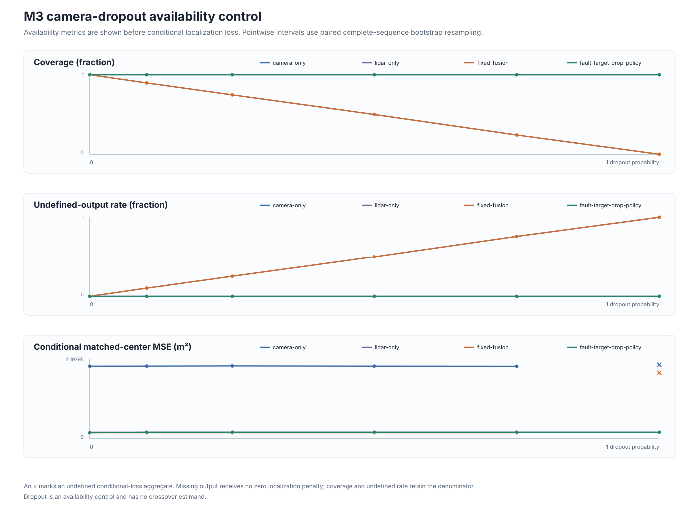
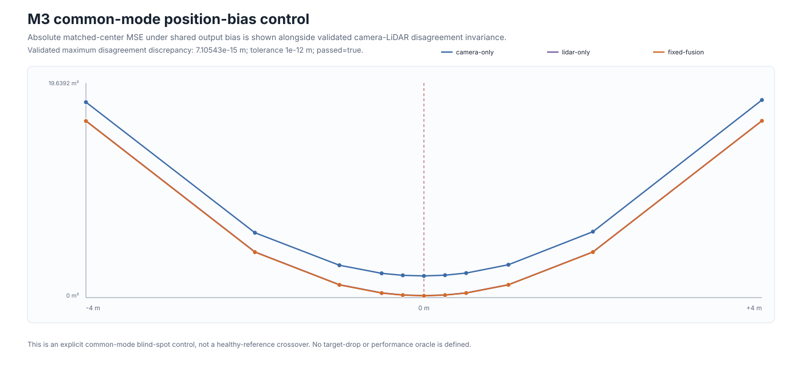
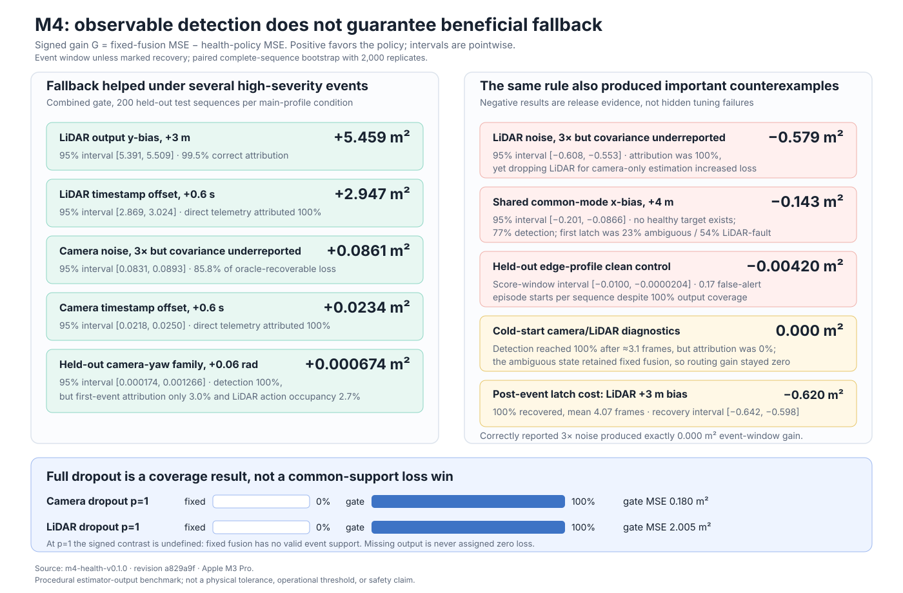

# Results

Status: **M1 analytic, M2 geometry-validation, M3 temporal procedural, and M4
observable-health evidence released**.

The release is
[`m1-analytic-v0.1.0`](../reports/releases/m1-analytic-v0.1.0/README.md).
It contains three preregistered, CPU-only Gaussian estimator-output
experiments generated by source revision
`524c8f70ece3eca2e61796165b23ffe51baadfbc` on an Apple M3 Pro. Each
experiment uses 200 complete sequences and 2,000 paired sequence-bootstrap
replicates.

The primary signed contrast is

\[
D_H(s)=\bar L_F(s)-\bar L_H(s),
\]

where \(H\) is the modality designated healthy by the controlled single-sensor
fault. Negative values favor fixed fusion; positive values mean fixed fusion
has higher matched-center MSE than the healthy modality.

## Crossover evidence

| Controlled axis | Point-curve root | 95% bootstrap interval | Crossing fraction \(q\) | Status | Population grid / continuous reference |
|---|---:|---:|---:|---|---:|
| Camera \(x\)-bias, negative | 3.212646 m | [1.310353, 4.971038] m | 1.0000 | Observed | 3.828279 / 3.869066 m |
| Camera \(x\)-bias, positive | 2.964184 m | [1.128775, 4.580194] m | 1.0000 | Observed | 3.828279 / 3.869066 m |
| Camera noise, correctly reported | 3.539641 std-scale | Undefined | 0.6325 | **Undetermined** | Not crossed through 4 / no finite root |
| Camera noise, underreported | 1.291643 std-scale | [1.044729, 1.582521] std-scale | 1.0000 | Observed | 1.463068 / 1.465755 std-scale |

The correctly reported-noise row is a required negative result. Although its
finite-sample point curve crosses zero, only 1,265 of 2,000 bootstrap curves
cross. The preregistered rule therefore withholds an interval and assigns
`undetermined`; it supports neither a finite-sample crossover claim nor a
finite-sample no-crossover claim. Its population reference has no crossing on
the tested grid through scale 4 and no finite continuous root.

At correctly reported noise scale 4, the signed contrast is
\(0.000293132\ \mathrm{m}^2\), with interval
\([-0.00139766,0.00208743]\ \mathrm{m}^2\); this near-zero endpoint explains
why the finite-sample status remains uncertain.

## Interpretation boundary

The supported comparison is categorical: in this paired Gaussian benchmark,
the underreported-covariance case produced an `observed` finite-sample
crossover, while the correctly reported case remained `undetermined` and its
population reference has no finite root. No cross-experiment root-difference
estimand or interval was preregistered, so the release does not quantify an
“earlier by” effect.

Meters and standard-deviation scales are distinct controlled coordinates and
are not comparable as one severity. The release does not evaluate learned
detectors, raw sensors, calibration or timing faults, nuScenes scenes, natural
fault rates, planning, collisions, or fleet behavior. Its roots are not
physical sensor tolerances or safety thresholds.

The release includes the complete
[claim-evidence map](../reports/releases/m1-analytic-v0.1.0/claim-evidence.md),
[verification record](../reports/releases/m1-analytic-v0.1.0/verification.md),
curated machine-readable aggregates, figures, manifests, analytic oracles, and
named hardware records.

## M2 geometry implementation validation

The
[`m2-geometry-v0.1.0`](../reports/releases/m2-geometry-v0.1.0/README.md)
release validates the geometry foundation used by later temporal experiments.
It is not a crossover or perception-performance result.

All preregistered synthetic transform, projection, box, and covariance gates
passed. The largest nonlinear covariance gate ratio was
`0.019455935342375528` against the pass boundary of one, using 200,000
draws. The independent synthetic projection disagreement was
`1.4779288903810084e-12` pixels against `1e-9`, and the largest transform
translation disagreement was `2.8421709430404007e-13` meters against `1e-10`.

One user-provided tree matching the declared nuScenes v1.0-mini profile
attested the fixed expected counts of 10 scenes, 404 samples, and 18,538 sample
annotations; fixed structural checks; 808 referenced CAM_FRONT/LIDAR_TOP
key-frame existence checks; an independent-scalar/production projection
cross-check; and generation of a visually inspected local diagnostic. The
public record contains none of the source rows, tokens, paths, residuals, or
diagnostic geometry and explicitly states
`summary-does-not-authenticate-dataset-bytes`.

The exact numeric selectors, source revision, named CPU run, separate dataset
terms, and recomputable-versus-attested boundary are recorded in the
[M2 claim-evidence ledger](../reports/releases/m2-geometry-v0.1.0/claim-evidence.md).
These values are implementation-validation errors and expected-profile
aggregates, not local nuScenes projection residuals, calibration tolerances,
or evidence of real sensor-noise transfer.

## M3 temporal procedural benchmark

The
[`m3-procedural-v0.1.0`](../reports/releases/m3-procedural-v0.1.0/README.md)
release applies the frozen estimator-output fault matrix to 48-frame,
known-object constant-velocity sequences. Main experiments use 200 complete
test sequences; the edge common-mode control uses 100. Inference uses 2,000
paired complete-sequence bootstrap replicates and remains separate for every
physical axis.

| Controlled axis | Direction | Point root | Pointwise 95% interval / bound | Status |
|---|---|---:|---:|---|
| LiDAR \(y\)-bias (m) | negative | 1.396885 | [1.389999, 1.403711] | Observed |
| LiDAR \(y\)-bias (m) | positive | 1.394257 | [1.387488, 1.400848] | Observed |
| Correctly reported camera noise (std-scale) | increase | — | [4, \(+\infty\)) | **Not observed** |
| Underreported camera noise (std-scale) | increase | 1.447532 | [1.425811, 1.468958] | Observed |
| Camera calibration \(x\) (m) | negative | 1.383889 | [1.345956, 1.420950] | Observed |
| Camera calibration \(x\) (m) | positive | 1.423728 | [1.380638, 1.462783] | Observed |
| Camera calibration yaw (rad) | negative | 0.035211 | [0.034094, 0.036401] | Observed |
| Camera calibration yaw (rad) | positive | 0.034083 | [0.032989, 0.035079] | Observed |
| Camera timestamp offset (s) | negative | 0.353579 | [0.341724, 0.366203] | Observed |
| Camera timestamp offset (s) | positive | 0.367082 | [0.352732, 0.380076] | Observed |

Every observed bootstrap crossing fraction was one. The correctly reported
noise curve remained beneficial through `4×`, with signed
fixed-minus-healthy loss `-0.0010478879 m²` at the endpoint. Underreporting
the same actual noise scale produced `+0.1897431948 m²`. This is a controlled
covariance-reporting contrast, not an estimate of a physical noise regime.

### Availability and blind-spot controls

Camera and fixed-fusion coverage at dropout probabilities
\([0,.1,.25,.5,.75,1]\) was
\([1,.896875,.746771,.500104,.241875,0]\). At full dropout their conditional
localization losses are undefined, never zero-imputed; LiDAR-only and the
diagnostic target-drop policy retain full coverage.

Under shared common-mode \(x\)-bias, fixed-fusion matched-center MSE increased
from `0.1650957575 m²` at identity to `16.1559127057 m²` at `-4 m` and
`16.1742788093 m²` at `+4 m`. Camera-LiDAR disagreement nevertheless remained
invariant to a maximum discrepancy of `7.1054273576e-15 m`, below the
predeclared `1e-12 m` gate. Agreement alone therefore cannot identify this
benchmark error.

The aggregate-only package contains every one of the 429 aggregate and 10
crossover records. It omits 71,700 local sequence rows while committing their
exact hashes, byte lengths, and record counts. Two full runs on the named Apple
M3 Pro matched on all 48 indexed scientific members. The
[independent adversarial review](reviews/m3-results-review.md) found no
release blocker.

These M3 results are procedural estimator-output stress tests. They are not
physical calibration or timing tolerances, detector results, real
sensor-noise transfer, nuScenes persistence, a health-aware fallback result,
or safety evidence.

## M4 observable health-aware fallback

The
[`m4-health-v0.1.0`](../reports/releases/m4-health-v0.1.0.md) release fits
clean residual ECDFs on 200 training sequences, selects one of 36 threshold
pairs on 200 validation sequences, and applies the frozen fit to 47 held-out
conditions. Main conditions use 200 test sequences and edge controls use 100.
Inference uses 2,000 paired complete-sequence bootstrap replicates.

The selected combined gate used self threshold `0.999` and cross threshold
`0.995`. Its primary signed event-window estimand is

\[
G_P=\bar L_F-\bar L_P,
\]

computed on fixed-policy common support. Positive values mean lower
matched-center MSE for the health policy.

| Held-out test condition | \(G_P\), m² | Pointwise 95% interval | Event attribution |
|---|---:|---:|---:|
| LiDAR output \(y\)-bias, \(+3\) m | +5.458996 | [5.390819, 5.509366] | 99.5% |
| LiDAR timestamp offset, \(+0.6\) s | +2.946629 | [2.868592, 3.023793] | 100% |
| Camera noise, `3×`, covariance underreported | +0.086143 | [0.083089, 0.089319] | 98.5% |
| Camera timestamp offset, \(+0.6\) s | +0.023411 | [0.021776, 0.024989] | 100% |
| Camera calibration \(x\), \(+3\) m | +0.001524 | [0.000490, 0.002780] | 4.0% |
| Held-out camera yaw, \(+0.06\) rad | +0.000674 | [0.000174, 0.001266] | 3.0% |
| LiDAR noise, `3×`, covariance underreported | **−0.578576** | [−0.608040, −0.553247] | 100% |

The final row is the main policy counterexample. The monitor correctly
identified the degraded LiDAR stream, but camera-only fallback discarded
useful information and raised downstream loss. Observable fault attribution
is therefore not a sufficient proxy for action utility.

### Controls and support

- Correctly reported `3×` camera and LiDAR noise produced exactly `0 m²`
  event-window policy gain.
- Main clean and bounded-acceleration score-window regression was
  `1.0529e-5 m²` in favor of fixed fusion. The held-out edge clean condition
  regressed by `0.00419894 m²`
  (`[0.00002045,0.0100138] m²` magnitude interval) and produced `0.17`
  false-alert episode starts per sequence.
- Under shared common-mode \(+4\) m bias, no healthy target was defined. The
  combined rule detected 77% of events but produced
  \(G_P=-0.142977\ \mathrm{m}^2\),
  interval \([-0.201134,-0.086554]\).
- Cold-start camera calibration and LiDAR-bias events reached 100% detection
  after about 3.1 frames but 0% first-event attribution. The ambiguous state
  retained fixed fusion, yielding exactly zero policy gain.
- Event clearance was also not free. After the beneficial LiDAR `+3 m` bias
  event, every latched episode recovered in a mean `4.07` frames, but the
  recovery-window gain was `−0.620387 m²`
  (`[−0.642015,−0.597787]`). The three-frame recovery latch traded switching
  stability for measurable post-event loss.
- At full target dropout, fixed-fusion event coverage was zero and conditional
  loss was undefined. The combined gate restored full coverage with
  conditional loss `0.180453 m²` for camera dropout and `2.005130 m²` for
  LiDAR dropout. No common-support policy gain is defined at this endpoint.

Two complete fits and two complete evaluations on the Apple M3 Pro matched on
all 16 indexed scientific members. Evaluation wall times were `592.01 s` and
`559.82 s`; peak RSS was `169,869,312` and `168,116,224` bytes.

The strict release retains all 11,515 aggregate rows and exact commitments for
433,700 omitted sequence loss/contrast/event rows. Its
[claim-evidence ledger](../reports/releases/m4-health-v0.1.0-claim-evidence.md)
maps each number to an exact aggregate selector.

M4 remains a known-ID procedural estimator-output benchmark. It does not
evaluate detector AP, raw-sensor effects, natural fault rates, nuScenes
persistence, planning, collisions, or a production fallback.

<!-- FFB-M5-RELEASE-PROJECTION-V1:START -->
M5 reviewed release projection pending.
<!-- FFB-M5-RELEASE-PROJECTION-V1:END -->
